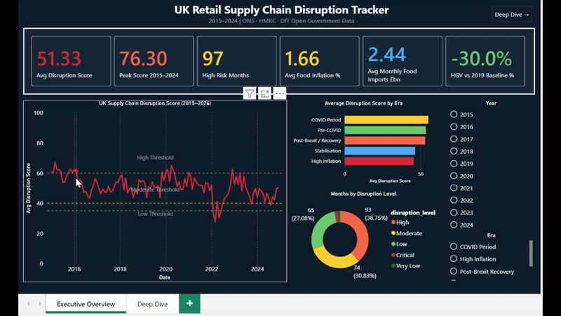
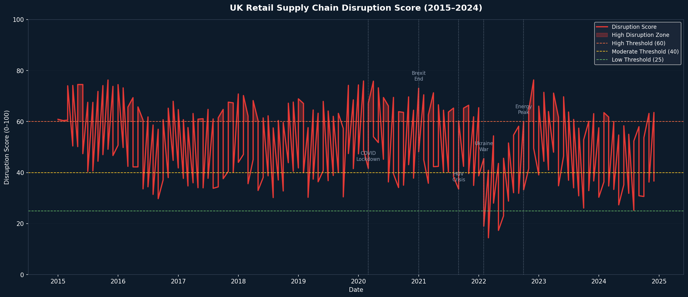
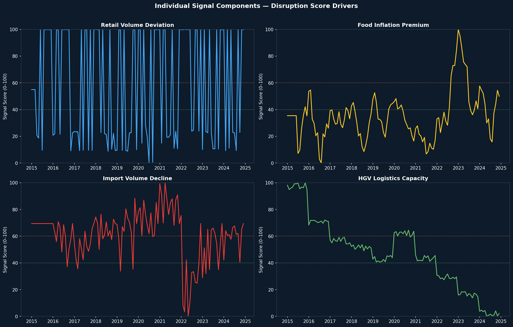
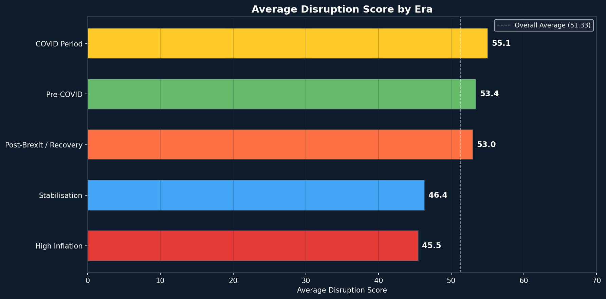
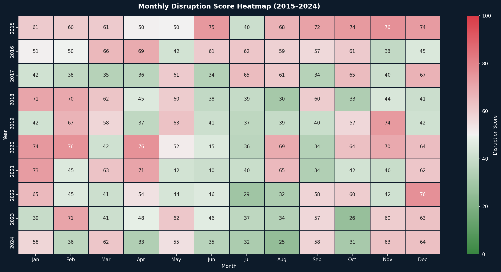
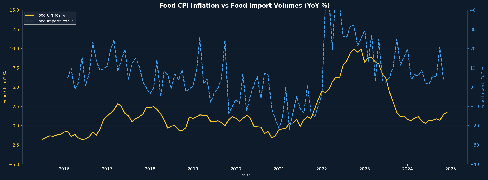
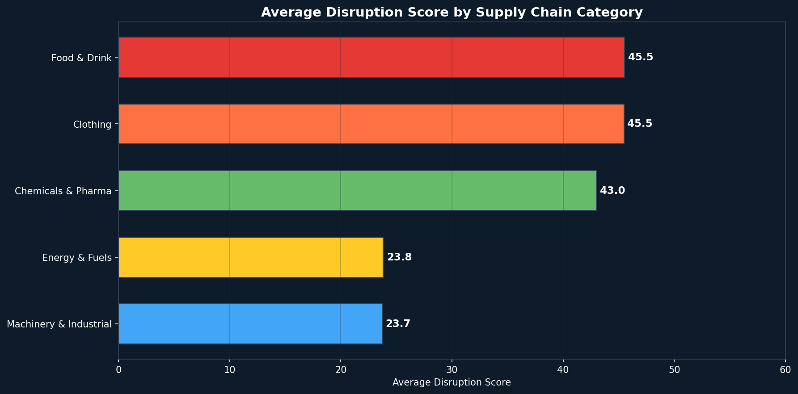
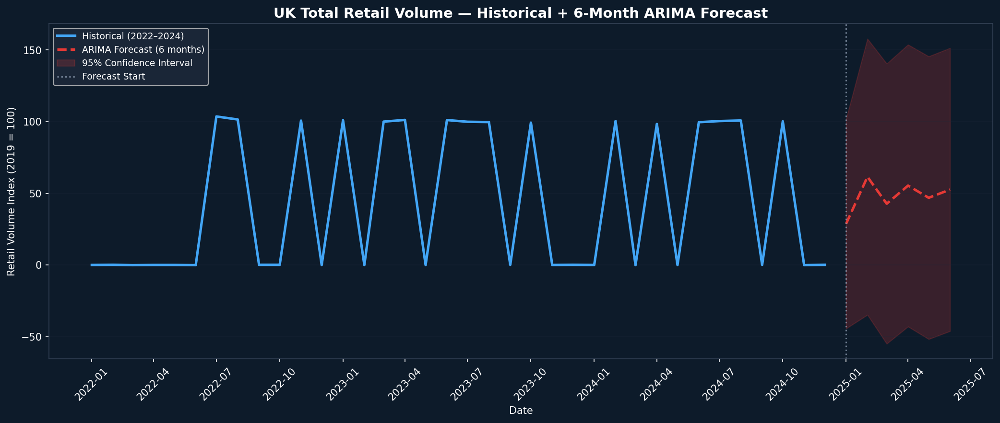

# UK Retail Supply Chain Disruption Tracker

> An end-to-end data analytics pipeline that combines four UK government open
> data sources into a composite monthly Disruption Score, tracking how severely
> UK retail supply chains were stressed between 2015 and 2024.


---

## The Problem

Post-Brexit (January 2021) and post-COVID, UK retail supply chains experienced
severe and simultaneous stress: HGV driver shortages caused empty supermarket
shelves, food import volumes dropped sharply, and food inflation ran persistently
above general CPI. All of this data exists in public government sources — but
nobody had connected it into a single analytical view.

This project builds that view.

---

## Key Findings

| Metric | Value                                  |
|--------|----------------------------------------|
| Analysis period | January 2015 – December 2024           |
| Total months analysed | 120                                    |
| Average disruption score | 51.33 / 100                            |
| Peak disruption score | 76.30 / 100                            |
| Peak disruption month | December 2022                          |
| High or Critical disruption months | 97 out of 120 (80.8%)                  |
| Peak food inflation (YoY) | 9.97% — December 2022                  |
| Average food inflation (YoY) |	1.66% |
| ARIMA forecast accuracy (MAPE) |	2.94% — Excellent |
| ARIMA test period	March 2023 | October 2024 |
| HGV licensed vehicles 2019 avg | 	515,000 |

**December 2022** was the single worst month in the dataset — the confluence
of peak food inflation (9.97% YoY), post-Brexit import disruption, energy
crisis, and residual HGV logistics strain all peaking simultaneously.

The **COVID Period** (March 2020 – December 2020) recorded the highest average
disruption score at 55.06, followed closely by Pre-COVID at 53.41 — suggesting
the UK retail supply chain was already under meaningful strain before the
pandemic.

The **High Inflation era** (February 2022 – June 2023) counter-intuitively 
recorded the lowest average disruption score at 45.48, despite food 
inflation peaking at 9.97% YoY. This is mathematically explained by the 
model's weight structure: Food CPI Premium carries only 25% weight, while 
Retail Volume Deviation and Import Volume Decline together carry 60% 
combined weight. By early 2022, post-pandemic retail volumes had recovered 
strongly and import flows had stabilised, these two dominant signals pulled 
the composite score downward despite surging prices. This demonstrates a 
key insight: price inflation and supply availability are decoupled signals 
in post-crisis economies.

---

## The Disruption Score

The composite Disruption Score (0–100) is built from four normalised signals:

| Signal | Source | Weight | Logic |
|--------|--------|--------|-------|
| Retail Volume Deviation | ONS Retail Sales Index | 30% | How far monthly sales fall below their 12-month rolling average |
| Food CPI Premium | ONS Consumer Price Index | 25% | How much faster food prices rise vs. general goods |
| Food Import Decline | HMRC Overseas Trade Statistics | 30% | Year-on-year drop in food and live animal imports |
| HGV Logistics Capacity | DfT TSGB04 Freight Statistics | 15% | Licensed HGV vehicle count vs. 2019 baseline |

Each signal is independently normalised to 0–100 using min-max scaling.
Higher score = more disruption. Scores above 60 are classified as High.
Scores above 75 are Critical.

---
## Architecture

| Data Sources | | ETL & Modelling | | Output |
| :--- | :---: | :--- | :---: | :--- |
| ONS Retail Sales (API & Excel) | ➔ | Python (pandas) | ➔ | MySQL Database |
| HMRC Trade Statistics (CSV) | ➔ | Disruption Score Model | ➔ | Power BI Dashboard (.pbix) |
| ONS CPI Data (API & Excel) | ➔ | ARIMA Forecasting | ➔ | GitHub Repository |
| DfT HGV Statistics (Excel) | ➔ | Jupyter EDA | ➔ | Animated GIF Demo |

## Dashboard



> Full interactive dashboard built in Power BI Desktop.
> Source file: `uk_supply_chain_dashboard.pbix` — download and open locally.

---

## Exploratory Analysis Charts

### 1. Disruption Score Timeline (2015–2024)


### 2. Signal Component Breakdown


### 3. Average Disruption Score by Era


### 4. Monthly Disruption Heatmap


### 5. Food CPI Inflation vs Food Import Volumes


### 6. Disruption Score by Supply Chain Category


### 7. ARIMA Retail Volume Forecast


### Page 1 — Executive Overview
- 6 KPI cards: avg score, peak score, high risk months, food inflation,
  food imports, HGV baseline comparison
- Disruption score timeline (2015–2024) with threshold reference lines
- Average disruption score by era (bar chart)
- Months by disruption level (donut chart)
- Year and Era slicers

### Page 2 — Deep Dive Analysis
- Signal component area chart (what is driving disruption month by month)
- Disruption score by supply chain category
- Monthly disruption heatmap (year × month matrix with color gradient)
- 6-month ARIMA retail volume forecast with confidence intervals

---

## Tech Stack

| Tool | Purpose |
|------|---------|
| Python 3.11 | ETL, modelling, forecasting |
| pandas | Data cleaning and transformation |
| statsmodels | Time series decomposition and ARIMA |
| SQLAlchemy + PyMySQL | MySQL connectivity |
| MySQL | Relational data storage (4 tables) |
| Power BI Desktop | Dashboard and visualisation |
| Jupyter Notebook | Exploratory data analysis |
| GitHub | Version control and portfolio |

---

## Data Sources — All Free, Open Government Data

| Source | Dataset | URL |
|--------|---------|-----|
| ONS | Retail Sales Index Reference Tables | https://www.ons.gov.uk/businessindustryandtrade/retailindustry |
| HMRC | Overseas Trade Statistics API | https://api.uktradeinfo.com |
| ONS | Consumer Price Inflation Tables | https://www.ons.gov.uk/economy/inflationandpriceindices |
| DfT | TSGB04 Freight Statistics | https://www.gov.uk/government/statistical-data-sets/tsgb04-freight |

---

## Project Structure

```text
uk_supply_chain_tracker/
├── data/
│   ├── raw/                        # Downloaded government files (not committed)
│   ├── processed/                  # Cleaned and merged CSVs
│   └── exports/                    # Final files for Power BI and MySQL
├── scripts/
│   ├── 01_fetch_ons_data.py        # ONS Retail Sales loader
│   ├── 02_fetch_hmrc_data.py       # HMRC Trade API fetcher
│   ├── 03_fetch_cpi_data.py        # ONS CPI loader
│   ├── 04_fetch_hgv_data.py        # DfT HGV loader
│   ├── 05_clean_and_merge.py       # Master table builder
│   ├── 06_build_disruption_score.py# Composite score model
│   ├── 07_arima_forecast.py        # ARIMA forecasting
│   └── 08_load_to_mysql.py         # MySQL loader
├── eda/
│   └── exploratory_analysis.py  # EDA and insight generation
├── uk_supply_chain_dashboard.pbix  # Power BI dashboard file
├── config.py                       # Path configuration
├── requirements.txt                # Python dependencies
├── .env.example                    # Environment variable template
└── README.md
```

---

## Setup Instructions

```bash
# Clone the repository
git clone https://github.com/angelvbenit/uk-supply-chain-disruption-tracker.git
cd uk-supply-chain-disruption-tracker


# Create virtual environment
python -m venv .venv

# Activate it
# Windows:
.venv\Scripts\activate
# Mac/Linux:
source .venv/bin/activate

# Install dependencies
pip install -r requirements.txt

# Configure environment
cp .env.example .env
# Edit .env with your MySQL password

# Run the pipeline in order
python scripts/01_fetch_ons_data.py
python scripts/02_fetch_hmrc_data.py
python scripts/03_fetch_cpi_data.py
# Script 04 requires a manual download first:
# Go to: https://www.gov.uk/government/statistical-data-sets/tsgb04-freight
# Download the TSGB04 Excel file and save to data/raw/hgv_licensing.xlsx
# The DfT does not provide a live API — this is a manual Excel download only.
python scripts/04_fetch_hgv_data.py
python scripts/05_clean_and_merge.py
python scripts/06_build_disruption_score.py
python scripts/07_arima_forecast.py
python scripts/08_load_to_mysql.py
```

---

## License

MIT License — free to use with attribution.

All government data used in this project is published under the 
[Open Government Licence v3.0](https://www.nationalarchives.gov.uk/doc/open-government-licence/version/3/).
